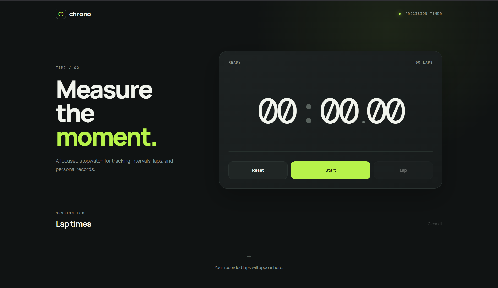
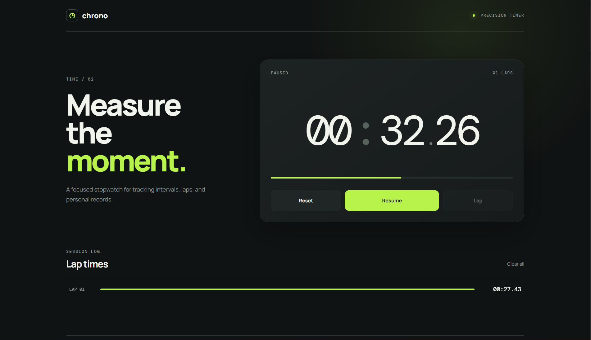

# Chrono — Stopwatch Web Application

A responsive and interactive stopwatch web application developed as part of **SkillCraft Technology Web Development Task 02**.

## 🌐 Live Demo

**[View Live Website](https://rudreshh07-jpg.github.io/SCT_WD_2/)**

## 📸 Screenshots

### Stopwatch — Initial State



### Stopwatch — Lap Recorded



## 🎯 Task Objective

Create an interactive and user-friendly stopwatch application with controls for starting, pausing, resetting, and recording lap times.

## ✨ Features

* Start and pause the stopwatch
* Resume the stopwatch
* Reset the timer
* Record lap times
* Display recorded laps
* Clear lap records
* Responsive design
* Simple and user-friendly interface

## 🛠️ Technologies Used

* HTML5
* CSS3
* JavaScript

## 📂 Project Structure

```text
SCT_WD_2/
│
├── index.html
├── style.css
├── script.js
├── README.md
├── stopwatch-home.png
└── stopwatch-lap.png
```

## ▶️ How to Run

1. Clone or download this repository.
2. Open the project folder.
3. Make sure `index.html`, `style.css`, and `script.js` are in the same folder.
4. Open `index.html` in a web browser.
5. Click **Start** to begin the stopwatch.
6. Use **Pause**, **Resume**, **Lap**, and **Reset** as required.

No additional software, packages, or installation is required.

## 📋 Task Information

**Organization:** SkillCraft Technology
**Task:** Task 02 — Stopwatch Web Application
**Domain:** Web Development

## 👨‍💻 Author

**G Naga Rudresh **

